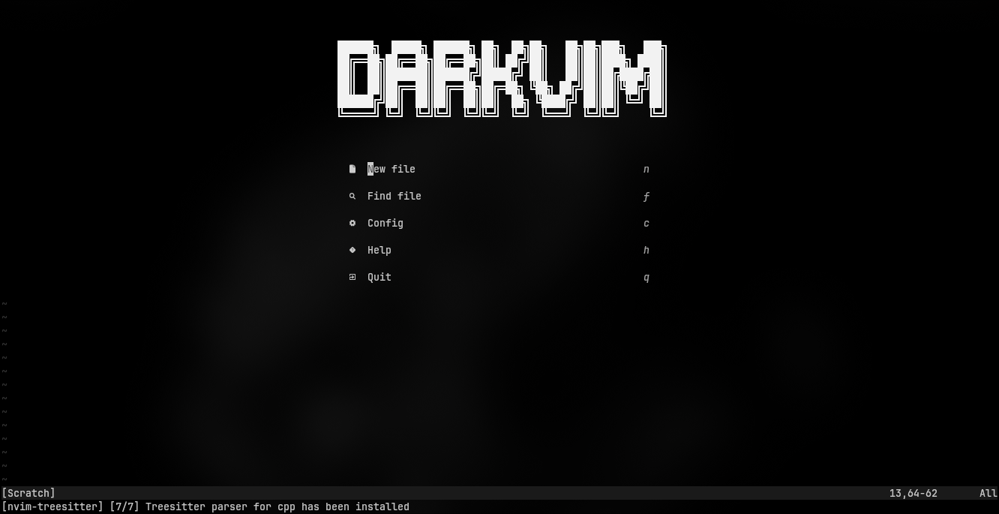
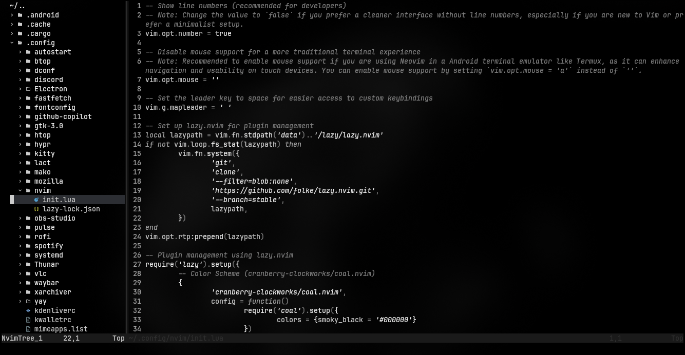
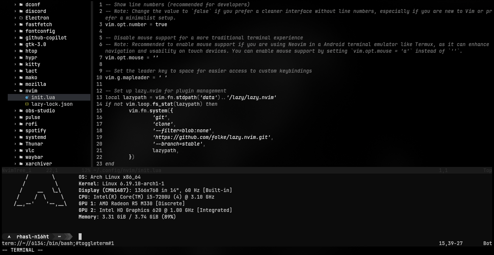

# DarkVim

DarkVim is a Neovim setup designed to enhance productivity and comfort in software development. With a focus on speed, efficiency, and aesthetics, DarkVim provides an optimal working environment for developers. DarkVim can also be used on Android devices via Termux, enabling development anywhere.

### Screenshots





## Features

- **Dark Theme**: DarkVim uses the [coal.nvim](https://github.com/cranberry-clockworks/coal.nvim) dark theme, which is easy on the eyes.

- **Transparent Background**: Adds a transparency effect to enhance aesthetics.

- **File Explorer Panel**: [nvim-tree](https://github.com/nvim-tree/nvim-tree.lua) for easy project navigation with an intuitive file explorer panel.

- **Integrated Terminal**: [toggleterm](https://github.com/akinsho/toggleterm.nvim) built-in terminal to run commands without leaving the editor.

- **LSP Support**: Integration with Language Server Protocol for features like autocompletion, linting, and diagnostics. (Check the config file for more information)

- **GitHub Copilot Autocompletion**: Harnesses the power of AI [copilot.vim](https://github.com/github/copilot.vim) to provide relevant code suggestions and boost productivity.

> [!WARNING]
> Older Android devices or custom ROMs with low specifications may experience performance issues with the GitHub Copilot feature. It is recommended to disable this feature if you experience lag or performance problems.

## Requirements

- Neovim version 0.11 or newer
- Nerd Font for optimal icons (optional but recommended)
- C compiler for `nvim-treesitter`

## Installation

- Install Neovim on your system.
  For Linux:
```bash
   sudo apt install neovim # Debian/Ubuntu-based
   sudo dnf install neovim # Fedora-based
   sudo pacman -S neovim # Arch-based
   pkg install neovim # Android via Termux
```
  For macOS (using Homebrew):
```bash
   brew install neovim
```
  For Windows (using Winget):
```powershell
   winget install Neovim.Neovim
```

- Install `init.lua` to your Neovim config directory.
  For Linux/macOS/Android:
```bash
   curl -o ~/.config/nvim/init.lua https://raw.githubusercontent.com/nightshade82id/darkvim/main/init.lua
```
  For Windows:
```powershell
   curl -o $env:APPDATA\nvim\init.lua https://raw.githubusercontent.com/nightshade82id/darkvim/main/init.lua
```

- Install a Nerd Font for optimal icons (JetBrains Mono Nerd Font recommended).
  For Linux:
```bash
   sudo pacman -S ttf-jetbrains-mono-nerd # Arch-based
   curl -OL https://github.com/ryanoasis/nerd-fonts/releases/download/v3.1.1/JetBrainsMono.tar.xz # other distros
```
  For macOS (using Homebrew):
```bash
   brew install --cask font-jetbrains-mono-nerd-font
```
  For Windows (using Winget):
```powershell
   winget install -e --id DEVCOM.JetBrainsMonoNerdFont
```

## Keybindings

### General

- `Ctrl + e`: Toggle file explorer
- `Ctrl + t`: Toggle terminal

### LSP (Language Server Protocol)

- `gd`: Go to definition
- `K`: Show documentation
- `gr`: Show references
- `Space + rn`: Rename symbol
- `Space + ca`: Code action
- `[d`: Previous diagnostic
- `]d`: Next diagnostic

### File Navigation and Management

- `Return / o`: Open file or directory
- `a`: Create new file or directory
- `d`: Delete file or directory
- `r`: Rename file or directory
- `x`: Cut file or directory
- `c`: Copy file or directory
- `p`: Paste cut or copied file or directory
- `R`: Refresh file explorer

## GitHub Copilot

- `:Copilot auth`: Authenticate with GitHub Copilot
- `:Copilot status`: Check Copilot status
- `:Copilot enable`: Enable Copilot
- `:Copilot disable`: Disable Copilot

## Credits

- [lazy.nvim](https://github.com/folke/lazy.nvim)
- [coal.nvim](https://github.com/cranberry-clockworks/coal.nvim)
- [nvim-treesitter](https://github.com/nvim-treesitter/nvim-treesitter)
- [alpha-nvim](https://github.com/goolord/alpha-nvim)
- [telescope.nvim](https://github.com/nvim-telescope/telescope.nvim)
- [copilot.vim](https://github.com/github/copilot.vim)
- [mason.nvim](https://github.com/williamboman/mason.nvim)
- [nvim-cmp](https://github.com/hrsh7th/nvim-cmp)
- [nvim-tree](https://github.com/nvim-tree/nvim-tree.lua)
- [toggleterm.nvim](https://github.com/akinsho/toggleterm.nvim)
